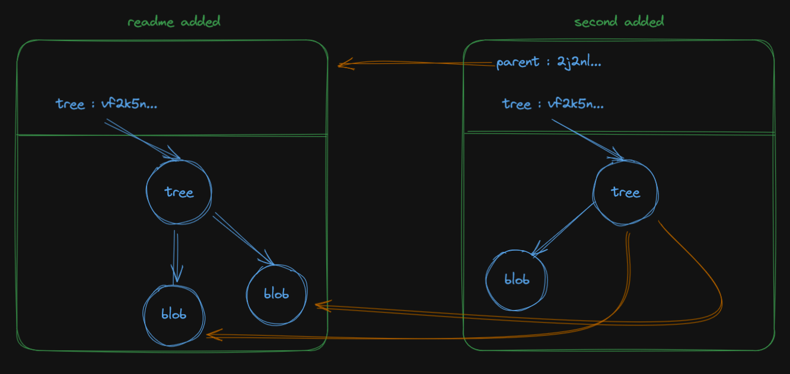
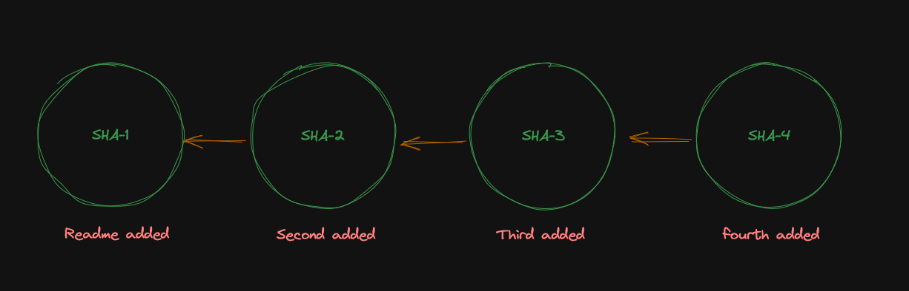

import Admonition from '@theme/Admonition';

# SHAs
git commits come with a sha (a hash with 0-9a-f characters).

:::info[Before You Ask]

SHA stands for `Secure Hashing Algorithm`, which is used to generate SHA's for each commit. These Sha inlucde basic info about repo, user, changes, time, etc...

That's why we have differnt SHA for same changes.

:::

Lets see our SHA

```bash
git log
```
```bash
commit 47f441203d412319a457e32ac8db0be07a08250c (HEAD -> master)
Author: digi-anuragk <anurag.kanwar@digital.ai>
Date:   Fri Apr 19 15:04:34 2024 +0530

readme added
```

```bash
commit 47f441203d412319a457e32ac8db0be07a08250c (HEAD -> master)
-------^ this is the SHA
```

# What SHA means to GIT

lets see where our SHA is stored

```bash
gci .\.git -Recurse -File -Name "f441203d412319a457e32ac8db0be07a08250c"
```

and lets cat it

```bash
cat .\.git\objects\47\f441203d412319a457e32ac8db0be07a08250c
```

We Found it was all 🗑️🗑️

# Tools of the plumber

to actually see the data in this file git provide us a cli tool

```bash
git cat-file -p <any-SHA>
```

```output
> git cat-file -p 47f441203d412319a457e32ac8db0be07a08250c
> tree 9bd9e28a95ee603c5e584689c84d6b9c4acee7cd
  author digi-anuragk <anurag.kanwar@digital.ai> 1713519274 +0530
  committer digi-anuragk <anurag.kanwar@digital.ai> 1713519274 +0530

  readme added
```

Another SHA, lets cat-file that

```bash
> git cat-file -p 9bd9e28a95ee603c5e584689c84d6b9c4acee7cd
> 100644 blob e845566c06f9bf557d35e8292c37cf05d97a9769    README.md
```

again

```bash
> git cat-file -p e845566c06f9bf557d35e8292c37cf05d97a9769
> README
```

# Key Concepts
1. **tree**: tree is analagous to directory/folder
2. **blob**: blob is analagous to file


:::info[BIG TAKEAWAY]

Git does not store diffs, git stores complete version of the entire source at the point of each commit. In other words, each commit contains all the information to completely reconstruct the source code that was tracked.

:::


# Lets Do a Second chnage

<Admonition type="note" icon="🤔" title="Problem">
With your amazing git skillz, create a second file, second.md, insert some text, stage, and commit the file.
    <Admonition type="info" icon="😎" title="Solution">

```bash
echo "second" >> second.md
git add .
git status
git commit -m "second added"
```

</Admonition>
</Admonition>

<Admonition type="note" icon="🤔" title="Problem">
Explore Your second commit' SHA
    <Admonition type="info" icon="😎" title="Solution">

use git log to get SHA

```bash
git log --oneline --graph
```
then see the content of the new SHA

```bash
git cat-file -p aa09ff3
```

</Admonition>
</Admonition>


# Wait Parent ?? 🤔 

Parent meanse just the previous commit

Visual representation of commit




So these commits are then visualized on a high level like this




direction of arrow meanse that this commit is ahead (in time) of previos commit and arrow is pointing towards parent.


we can also show this with 

```bash
git log --graph --oneline --parents
```

# Thing to notice

Compare tree of both the commits

`second added` commit shares the actual SHA of its presecdent (in this case immediate parent) commit with the `pointers`, means it does not store the entire worktree itself, which means its significantly more efficient space wise.


Hopefully now git feels less magical to you all 🫨