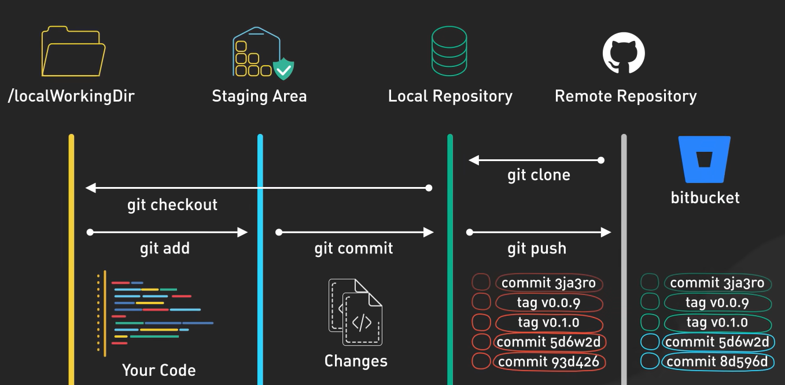

import Admonition from '@theme/Admonition';

# Git State

See default lists 
```bash
#local
git config --list

#global
git config --global --list
```

:::note

We have to add the most important config item


```bash
git config --add --global user.name "digi-anuragk"
git config --add --global user.email "anurag.kanwar@digital.ai"
```
These are basic git properties we have to add in order to able to perform actions from `cli`

:::


# Creating a new repo
The very first step of any project is to create a repo. To create a repo we use

```bash
git init
```
it will create a new `.git` folder inside directory.

<Admonition type="note" icon="🤔" title="Problem">
Create a new git repo at `/path/to/new/first-git-repo`. Replace `/path/to/new` to your preferred project location.
    <Admonition type="info" icon="😎" title="Solution">
The higher level steps are:

1. cd to /path/to/new
2. mkdir a new directory first-git-repo
3. cd into the new directory
4. call git init

Terminal commands:
```bash
cd .\Projects\git-hands-on\
mkdir first-git-repo
cd first-git-repo

git init
```

</Admonition>
</Admonition>

# The Files Are In the Git Repo
Every git repo comes with a directory that contains all of the state of the git repo. This repo is found in `.git`

# Key terms
Key Terms

1. **repo**: a git tracked project
   
2. **commit**: A point in time representing the project in its entirety.
    The sha that represents a commit, 40 a-f 0-9 characters, is calculated from contents of change, author, time, and more

3. **index**: I will use this term or staging area interchangeably. From the github blog

:::info

The Git index is a critical data structure in Git. It serves as the “staging area” between the files you have on your filesystem and your commit history. When you run git add , the files from your working directory are hashed and stored as objects in the index, leading them to be “staged changes”.

:::

4. **squash**: to take several commits and turn it into one commit
    technically a squash would be taking N commits and turning it into N - 1 to 1 commit. but typically its N commits to 1 commit

5. **work tree, working tree, main working tree**: This is your git repo. This is the set of files that represent your project. Your working tree is setup by git init or git clone.

6. **untracked files**: this means files that are not staged for the first time (indexed) or already committed / tracked by the repo. These files are the easiest to accidentally lose work on since git does not have any information about these files.

7. **indexed / staged**: this is where the changes are to be committed. You must stage before you commit and you stage changes by using the git add command. see man git-add for more information

8. **tracked**. These are files that are already tracked by git. Now a file could be tracked AND have staged changes (changes stored in the index) ready to be committed.

9. **remote**: The same git repo on another computer or directory. You can accept changes from or potentially push changes too. Think github

# The Basics
The next couple commands will be 80% of the commands you will execute when using git. 80% of git is exceptionally easy. Its the 20% that can get you into trouble 🫡

Now let identify where our data is stored in Git. The common assumption is that there are only 2 locations, but truth is our data is not stored in local machine and github. There are actually where our data lives in Git.



1. **Local Working Dir** : this is our playgroud,  our local working dir / local working tree (git terms), in which we have files and have `.git` folder.
2. **The Staging Area / Index** : it's a temporary holding spot for changes before committing. 
3. **Local Repo** : this is where we store committed changes locally.
4. **Remote Repo** : A server where we can store and backup our code, like Github, GitLab, BitBucket.

# Lets Understand Git general workflow

:::info

Most git commands move files between these 4 locations.

:::

1. **Make Local Repo**: We made it with `git init` command.
2. let's add some files.

    ```bash
    echo "README" >> README.md
    ```
3. Now use this command to see status of our git repo
    ```bash
    git status
    ```
4. Add files to track with github
   ```bash
   git add .\README.md

   # to add all files inside a dir
   git add .\
   ```
   and again check status with `git status`, we can see this file is added to our index / staging area.

5. Now lets make this as a permanent change of our repo with commit. To commit our change use below command:
   ```bash
   git commit -m "useful message about change"
   ```

    and now lets check status again : `git status`

**Congrats if it's your first commit 🎉**

6. Now a common activity in git is to check history of commits in our repo
   to see previos commits use: 
   ```bash
   git log
   ```

   but always use this with options
   ```bash
   # graph represtation with * as commit cp
   git log --graph 

   # to show only commit shah
   git log --oneline 

   # to show parent commit
   git log --parents 

   # for pipeing output
   git log --decorate 

   # to show commits for all branches, default to current branch only
   git log --all

   # n for any integer number, to show only n prv commits
   git log -n 

   #you can combine many option, by default people use
   git log --graph --oneline --decorate
   ```
