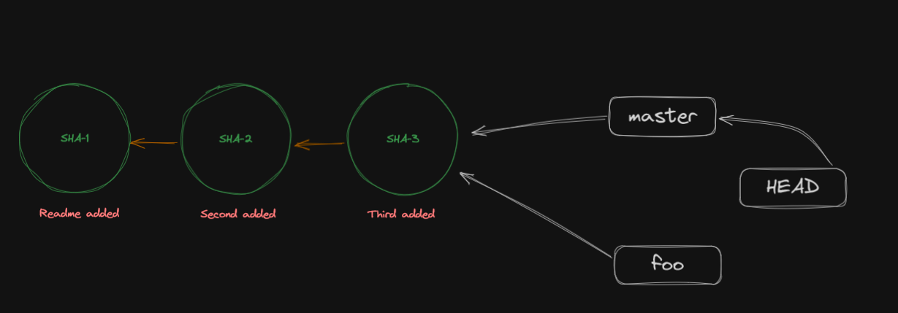

## Git Branches

Having branches makes it easy to work on different things at the same time; say you are working two days on a new feature and in the middle of it you find a bug that needs fixing, you can do that easily by using two branches.

This is where git branches shines. They are cheap and virtually free to create. With our of understanding git internals this will become much more clear throughout this section

<Problem>
Create a new git repo as `local-git`, and add our first commit in `README.md` with one line as `A` and commit message as `A`
    <Solution>
        Terminal commands:
        ```bash
        mkdir local-git
        cd local-git

        git init
        echo "A" >> README.md
        git add .
        git commit -m "A"
        ```

</Solution>
</Problem>

## Creating Branches

Creating Branches is easy

```bash
git branch foo
```

this will create a new branch named `foo`.

<Problem>
Create a new branch named `foo`.
    <Solution>
        Terminal commands:
        ```bash
        git branch foo
        ```

</Solution>
</Problem>

Well after running this command we can see, nothing happens visually. but we can use

```bash
git branch
```

to show all the branches present in our repo. `*` points to the repo which we are currently `checked out`.

:::info[Remember]

Git branch will diverge from the branch from which you have ran `git branch [BRANCH_NAME]` command. This also they will have all commit history off the branch from it is diverged.

:::

## What Actually is Branch to Git

Branches are just pointers to commits in tree.



thats why they are virtually free.

:::note

`HEAD` is a special pointer which always points to state of repo. Basically `HEAD` shows us where we are in our repo.

:::

## Switching Branches

You can switch branches easily in two ways

```bash
git switch <branch name>
git checkout <branch name>
```

`checkout` is a more versatile operation and i am personally just in the habit of using it and it is slightly more useful than `switch`.
`switch` is a specialized case of checkout which only helps in creating and switching branches.

So to remember this command people generally say `checkout` X branch instead to `switch` to X branch.

:::info

all the commands which accepts `<branch_name>` as a parameter, is actually accepts an commit SHA. (because branches are just pointers to commits)

:::

:::info

To make a new branch and checkout to it, you can use 

```bash
git checkout -b <branch_name>
```

:::


<Problem>
Checkout to new branch named foo.
    <Solution>
        Terminal commands:
        ```bash
        git checkout foo
        ```

</Solution>
</Problem>

<Problem>
Now we are on foo lets create another commit with message `B` and a new line added to `second.md` of `B`. Then do it again, except replace `B` with `C` at the end we want something like this

It will delete commits recursively until no commit or a commit which is present in another branch is encountered. 

:::

Ok now we have commits locked in, what to do now ?
