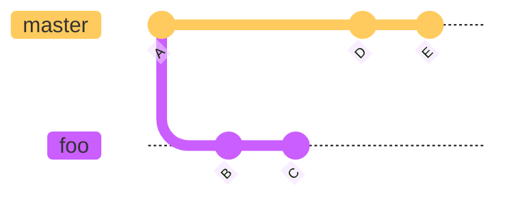

<Problem>
Lets start off by creating some more commits and adding them to `master`. This way our branches will diverge,  meaning they have commits that are unique in both and have a common ancestor, `A`.

Please add `D` and `E` in the README.md.

Desires State:



<Solution>
```bash
git checkout master

echo "D" >> README.md
git add .
git commit -m "D"

echo "E" >> README.md
git add .
git commit -m "E"

git log --oneline --graph
git log --oneline --graph foo

```
</Solution>
</Problem>
